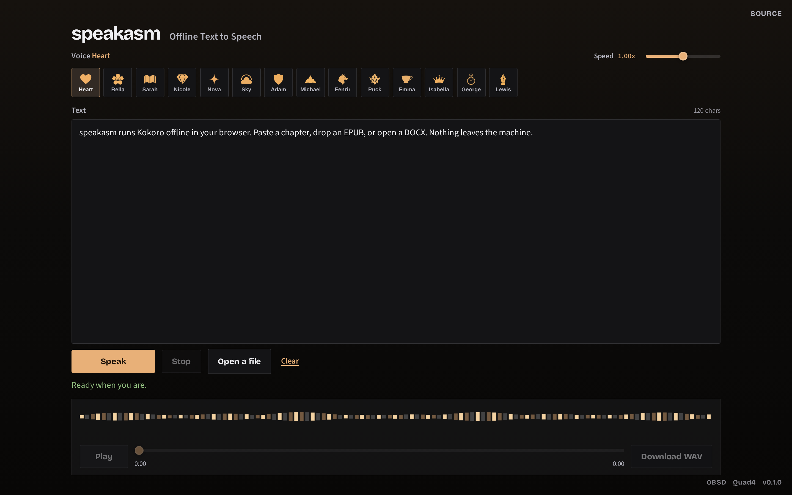

# speakasm

[](https://github.com/Quad4-Software/speakasm/actions/workflows/ci.yml) [](https://github.com/Quad4-Software/speakasm/releases) [](https://github.com/Quad4-Software/speakasm/blob/master/LICENSE) [](https://go.dev/dl/) [](https://speakasm.quad4.io) [](https://github.com/orgs/Quad4-Software/packages/container/package/speakasm) [](https://speakasm.quad4.io)

Offline text-to-speech in the browser via [Kokoro-82M](https://github.com/hexgrad/kokoro) ONNX. Nothing is uploaded.

**Live:** [https://speakasm.quad4.io](https://speakasm.quad4.io)



Kokoro weights (`web/models/`, ~92MB q8 + ~326MB fp32) and the vendored JS runtime are **not** in git. The Docker image downloads them at build time and ships a full offline stack. For a local source build, run `make assets` once.

Kokoro (82M, official browser ONNX via Transformers.js) was chosen over Pocket TTS for a lighter in-browser footprint and first-party WASM/WebGPU support. WebGPU uses fp32, WASM uses q8. See [kokorottsai.com](https://kokorottsai.com/) and the [hexgrad/kokoro](https://github.com/hexgrad/kokoro) repo.

## Install (Docker)

Clone and build (downloads Kokoro ONNX + vendor WASM into the image):

```bash
git clone https://github.com/Quad4-Software/speakasm.git
cd speakasm
docker compose up --build
```

Open [http://127.0.0.1:8080](http://127.0.0.1:8080).

Pre-built multi-arch image (`linux/amd64`, `linux/arm64`):

```bash
docker pull ghcr.io/quad4-software/speakasm:latest
docker run --rm -p 8080:8080 ghcr.io/quad4-software/speakasm:latest
```

Or with Compose against the published image:

```bash
git clone https://github.com/Quad4-Software/speakasm.git
cd speakasm
IMAGE=ghcr.io/quad4-software/speakasm:latest docker compose up
```

Coolify: use `docker-compose.coolify.yml` and set the domain to container port `8080`.

Bind on all interfaces: `HOST_PORT=0.0.0.0:8080 docker compose up --build`.

## Release binaries

Tagged releases publish static Go servers for Linux, Windows, macOS, FreeBSD, OpenBSD, NetBSD (amd64, arm64, arm, 386, riscv64, and other supported arches).

```bash
curl -LO https://github.com/Quad4-Software/speakasm/releases/latest/download/speakasm_X.Y.Z_linux_amd64.tar.gz
tar xzf speakasm_*.tar.gz
./speakasm -web /path/to/web -addr :8080
```

The binary serves a `web/` tree. For a full offline tree, clone and run `make assets`, or use the container image (recommended).

## Build from source

Needs Go 1.26+, Node (for vendoring kokoro-js), and curl.

```bash
git clone https://github.com/Quad4-Software/speakasm.git
cd speakasm
make assets
make build
make run
```

```bash
make test
make check
```

Binary: `bin/speakasm` (default listen `:8080`, web root `web`).

## Screenshots

With the app running locally (or set `SPEAKASM_URL`):

```bash
make screenshots
```

Writes `docs/screenshots/desktop.png` and `docs/screenshots/mobile.png`. CI also captures on UI changes and uploads the PNGs as workflow artifacts.

## Features

- Paste text or open TXT, Markdown, HTML, EPUB, DOCX
- Automatic cleanup of markup, nav junk, and ebook boilerplate
- Multiple Kokoro voices (US/UK)
- Speed control, streaming playback, WAV download
- Fully local after first load (models auto-cache for offline)
- PWA install + service worker caching

## License

0BSD
